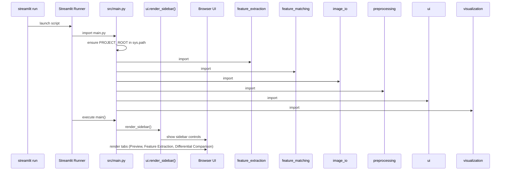
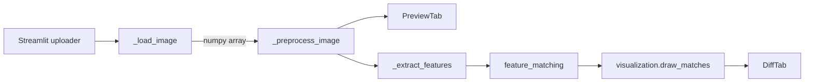

# Developer Manual — Medical Image Feature Extraction App

*Audience: beginner developer maintaining or extending this project.*

## 1. Project Bootstrapping Flow

This section explains what happens after running `streamlit run src/main.py`.

### 1.1 Runtime Timeline

> **Tip:** Mermaid diagrams render in compatible viewers. If the Markdown preview does not support it, paste into [https://mermaid.live](https://mermaid.live).

### 1.2 Import Responsibilities
- `feature_extraction` — wraps OpenCV ORB detector and returns `FeatureResult` objects.
- `feature_matching` — performs descriptor matching, filtering, and statistics.
- `image_io` — loads PNG files, validates arrays, converts color channels.
- `preprocessing` — normalizes intensity, applies smoothing, and computes frame differences.
- `ui` — renders Streamlit sidebar controls and metadata helpers.
- `visualization` — converts images for display, draws histograms/keypoints/matches.

After imports, `main()` configures the Streamlit page, draws the sidebar, and waits for user interaction.

## 2. File & Module Map

```
Assignment 2_FeatureExtraction/
├─ src/
│  ├─ main.py              # Streamlit entry point
│  ├─ ui.py                # Sidebar + metadata display helpers
│  ├─ image_io.py          # PNG decoding, validation, color conversion
│  ├─ preprocessing.py     # Normalization, smoothing, difference frames
│  ├─ feature_extraction.py# ORB detector wrapper
│  ├─ feature_matching.py  # Descriptor matching & summaries
│  └─ visualization.py     # Histograms, overlays, match drawing
├─ tests/                  # pytest suite for each module
├─ requirements.txt        # dependency list
├─ README.md               # setup & usage instructions
└─ developer_manual.md     # this document
```

## 3. Execution Walkthrough (Step-by-Step)

1. **Launch Command**
   - `streamlit run src/main.py`
   - Streamlit loads `main.py` and executes `main()` on each page refresh.

2. **Path Setup** (`PROJECT_ROOT` in `main.py`)
   - Ensures Python can import sibling modules under `src/` when the script is launched from anywhere.

3. **Sidebar Construction** (`ui.render_sidebar()`)
   - Streamlit renders sliders/check boxes for detector, preprocessing, and matching.
   - The sidebar returns three dataclasses:
     - `DetectorSettings`
     - `PreprocessingSettings`
     - `MatchingSettings`
   - These objects are used by downstream functions so you avoid passing loose dictionaries.

4. **File Upload Handling** (`st.file_uploader`)
   - Users can select multiple PNG slices.
   - Uploaded files are cached with `_load_image()` so repeated interactions avoid re-decoding.
   - The cache uses file bytes as the key; a re-upload triggers new decoding.

5. **Primary Image Selection** (`_select_image`)
   - Renders a select box with enumerated labels (`"1: filename.png"`), preventing duplicate-name collisions.

6. **Preview Tab**
   - Shows original image via `visualization.to_rgb`.
   - Displays metadata via `ui.display_metadata` and simple stats using `st.metric`.
   - Histogram rendered with `visualization.plot_histogram`.
   - If preprocessing settings alter the image (normalization/smoothing), a second preview is shown.

7. **Feature Extraction Tab**
   - `_extract_features` builds an ORB detector using settings from the sidebar.
   - `feature_extraction.extract_features` converts to grayscale, runs `detectAndCompute`, and returns keypoints/descriptors.
   - Overlay image produced with `visualization.draw_keypoints`.
   - User sees counts for keypoints and descriptors; warning appears if none are found.

8. **Differential Comparison Tab** (requires at least two images)
   - Optional explanatory text clarifies purpose.
   - Preprocesses secondary image with the same settings to keep consistency.
   - `preprocessing.compute_difference` outputs absolute difference for visualization.
   - Feature matching pipeline:
     1. Extract features for the secondary image.
     2. `feature_matching.match_descriptors` performs brute-force matching.
     3. `feature_matching.filter_matches_ratio` applies Lowe ratio filtering.
     4. `feature_matching.summarize_matches` produces aggregate stats.
   - `visualization.draw_matches` draws lines between matched keypoints.
   - When no matches remain, the UI surfaces a gentle warning.

## 4. Data Flow Summary



## 5. Extensibility Checklist

- **Add new detectors**: extend `feature_extraction.get_detector` to accept additional names (`"sift"`, `"hog"`) and provide parameter controls in `ui.render_sidebar`.
- **Introduce video support**: replace `st.file_uploader` with a frame iterator (e.g., `cv2.VideoCapture`), then re-use preprocessing and feature extraction functions per frame pair.
- **Persist results**: use `st.download_button` with match summaries or descriptor arrays (currently not implemented).

## 6. Testing Reference

- Run `pytest` to ensure core utilities behave deterministically.
- Tests cover:
  - Loading PNGs from disk/memory.
  - Smoothing and normalization edge cases.
  - ORB feature extraction on synthetic patterns.
  - Descriptor matching and summary stats.

## 7. Component Responsibilities (Detailed)

| Module | Key Functions | Notes |
|--------|---------------|-------|
| `src/main.py` | `_load_image`, `_preprocess_image`, `_extract_features`, `main` | Orchestrates the app and ties together the rest of the modules. |
| `src/ui.py` | `render_sidebar`, `display_metadata` | All Streamlit widgets are centralized here. |
| `src/image_io.py` | `load_png`, `validate_image`, `convert_color` | Strict input validation prevents downstream crashes. |
| `src/preprocessing.py` | `normalize_intensity`, `apply_smoothing`, `compute_difference` | Optionally executed prior to feature extraction. |
| `src/feature_extraction.py` | `get_detector`, `extract_features` | Returns `FeatureResult` dataclass with convenience counts. |
| `src/feature_matching.py` | `match_descriptors`, `filter_matches_ratio`, `summarize_matches` | Works with ORB descriptors; safe for empty inputs. |
| `src/visualization.py` | `to_rgb`, `plot_histogram`, `draw_keypoints`, `draw_matches` | Converts OpenCV outputs into Streamlit-friendly RGB visuals. |

## 8. Typical User Journey (UI Perspective)

1. Launch app → blank page with sidebar, awaiting uploads.
2. Upload first PNG → Preview tab shows image, stats, histogram.
3. Adjust detector sliders → keypoint overlay updates automatically.
4. Upload second PNG → Differential tab activates, showing difference image and matches.
5. Optional: adjust ratio threshold or smoothing to see how matches respond.

## 9. Troubleshooting Notes

- **Module import errors**: confirm `streamlit run src/main.py` from project root so the `PROJECT_ROOT` shim works; ensure virtual environment is active.
- **No keypoints detected**: try lowering `FAST threshold`, increasing `nfeatures`, or applying smoothing/normalization.
- **Images with different dimensions**: the app warns and skips matching; ensure slices are consistent or resample beforehand.
- **Streamlit deprecation warnings**: currently addressed (using `width="stretch"`). Watch release notes for future API changes.

## 10. Helpful References

- Streamlit docs: [https://docs.streamlit.io](https://docs.streamlit.io)
- OpenCV feature detection overview: [https://docs.opencv.org/4.x/d1/d89/tutorial_py_orb.html](https://docs.opencv.org/4.x/d1/d89/tutorial_py_orb.html)
- Lowe’s ratio test explanation: [https://docs.opencv.org/4.x/dc/dc3/tutorial_py_matcher.html](https://docs.opencv.org/4.x/dc/dc3/tutorial_py_matcher.html)

---
Feel free to annotate or expand this manual as you explore the codebase. A printed copy or PDF export from Markdown can serve as a quick study guide.
