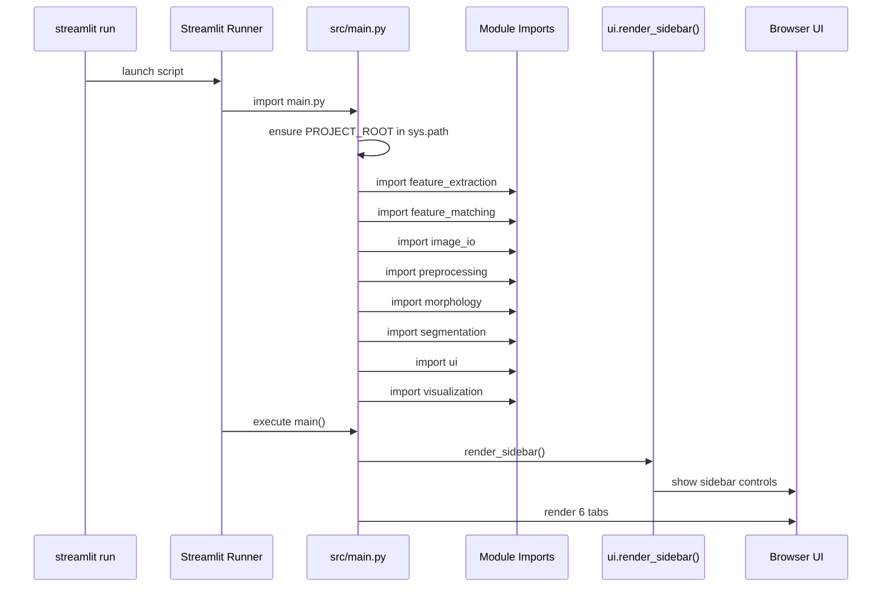
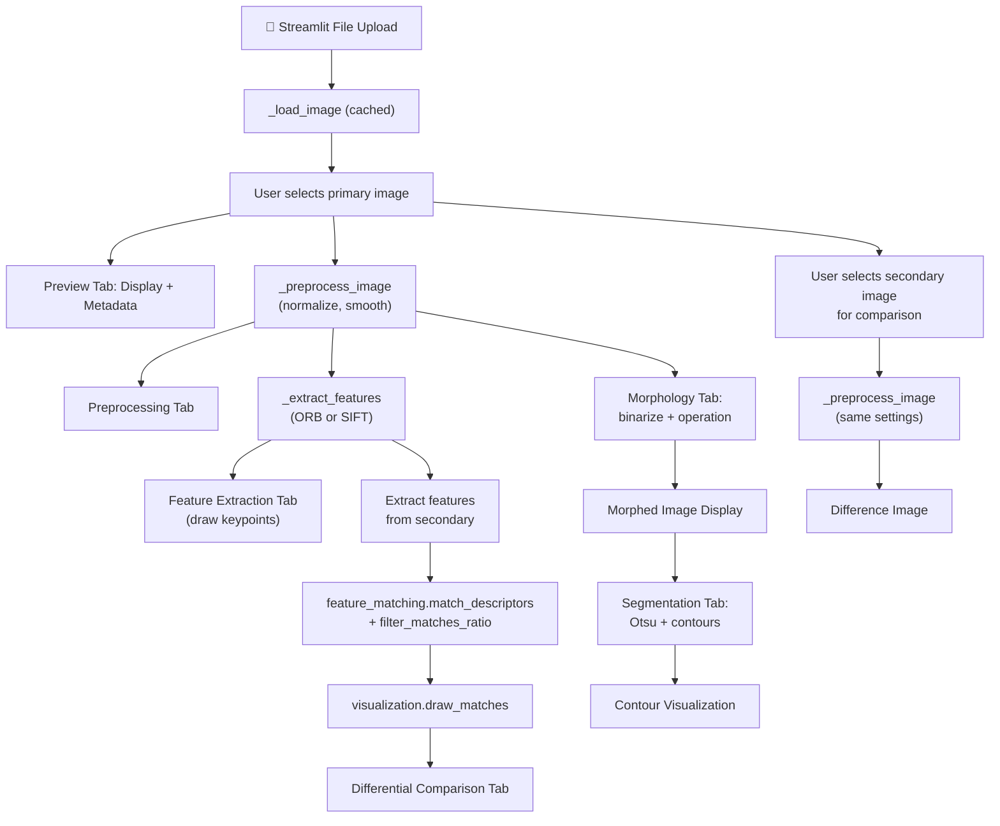

# Developer Manual — Medical Image ROI Detection Application

*Audience: beginner developer maintaining or extending this project.*
*Last Updated: November 28, 2025*

## Overview

This application combines **morphological operations**, **segmentation algorithms**, and **feature extraction & matching** to detect regions of interest (ROIs) in medical images. Built with Streamlit for rapid prototyping and OpenCV for image processing.

**Key Features:**
- Load and preview PNG medical image slices
- Apply preprocessing (normalization, smoothing)
- Morphological operations (binarization, erosion, dilation, opening, closing, gradient)
- Segmentation via Otsu thresholding and contour detection
- Feature extraction using ORB and SIFT detectors
- Feature matching for differential image comparison

---

## 1. Project Bootstrapping Flow

This section explains what happens after running `streamlit run src/main.py`.

### 1.1 Runtime Timeline

> **Tip:** Mermaid diagrams render in compatible viewers. If the Markdown preview does not support it, paste into [https://mermaid.live](https://mermaid.live).

### 1.2 Import Responsibilities
Core modules imported on startup:
- **`feature_extraction`** — wraps OpenCV ORB and SIFT detectors; returns `FeatureResult` objects.
- **`feature_matching`** — performs descriptor matching, ratio filtering, and statistics computation.
- **`image_io`** — loads PNG files, validates arrays, converts color channels.
- **`preprocessing`** — normalizes intensity, applies smoothing, computes frame differences.
- **`morphology`** — binarization, erosion, dilation, opening, closing, gradient morphological transforms.
- **`segmentation`** — Otsu thresholding, contour detection, and ROI boundary extraction.
- **`ui`** — renders Streamlit sidebar controls and metadata display helpers.
- **`visualization`** — converts images for Streamlit display, draws histograms/keypoints/matches/contours.

After all imports, `main()` configures the Streamlit page, draws the sidebar with all settings panels, and renders the six application tabs.

## 2. File & Module Map

```
Assignment 2_FeatureExtraction/
├─ src/
│  ├─ main.py              # Streamlit entry point & tab orchestration
│  ├─ ui.py                # Sidebar controls + metadata display helpers
│  ├─ image_io.py          # PNG decoding, validation, color conversion
│  ├─ preprocessing.py     # Normalization, smoothing, difference frames
│  ├─ morphology.py        # Binarization, erosion, dilation, opening, closing, gradient
│  ├─ segmentation.py      # Otsu thresholding, contour detection, ROI extraction
│  ├─ feature_extraction.py# ORB, SIFT, & Harris detector wrappers
│  ├─ feature_matching.py  # Descriptor matching & summary statistics
│  └─ visualization.py     # Histograms, overlays, match drawing, contour visualization
├─ tests/                  # pytest suite for each module
├─ requirements.txt        # dependency list (includes opencv-contrib-python for SIFT)
├─ README.md               # setup & usage instructions
└─ developer_manual.md     # this document
```

## 3. Execution Walkthrough (Step-by-Step)

1. **Launch Command**
   - `streamlit run src/main.py`
   - Streamlit loads `main.py` and executes `main()` on each page refresh.

2. **Path Setup** (`PROJECT_ROOT` in `main.py`)
   - Ensures Python can import sibling modules under `src/` when the script is launched from anywhere.

3. **Sidebar Construction** (`ui.render_sidebar()`)
   - Renders controls for all five settings categories:
     - `DetectorSettings` — Feature detector selection (ORB/SIFT) and parameters
     - `PreprocessingSettings` — Normalization, smoothing toggles
     - `MorphologySettings` — Binarization method/threshold, morphological operations, kernel parameters
     - `SegmentationSettings` — Contour area filtering, visualization toggles
     - `MatchingSettings` — Ratio test threshold
   - Settings objects are passed to downstream functions to avoid loose dictionaries.

4. **File Upload Handling** (`st.file_uploader`)
   - Users select multiple PNG slices via Streamlit widget.
   - Uploaded files are cached with `_load_image()` to avoid re-decoding on every interaction.
   - Cache key uses file bytes; re-upload triggers new decoding.

5. **Primary Image Selection** (`_select_image`)
   - Displays enumerated labels (`"1: filename.png"`) to prevent collisions with duplicate names.

6. **Tab 1: Preview Tab**
   - Shows original image via `visualization.to_rgb`.
   - Displays metadata (shape, dtype, min/max) via `ui.display_metadata`.
   - Shows numeric stats using `st.metric` (mean, std, etc.).
   - Renders histogram with `visualization.plot_histogram`.
   - If preprocessing is enabled, shows original + preprocessed side-by-side.

7. **Tab 2: Preprocessing Tab**
   - Allows toggling grayscale conversion, normalization, and smoothing.
   - Shows before/after previews.
   - Displays processing times for performance evaluation.

8. **Tab 3: Feature Extraction Tab**
   - Detects feature detector from sidebar (ORB, SIFT, or Harris).
   - Calls `feature_extraction.extract_features` with selected detector.
   - Converts to grayscale, runs `detectAndCompute`, returns keypoints/descriptors.
   - `visualization.draw_keypoints` overlays results on image.
   - Displays keypoint count, descriptor dimensionality, and processing time.
   - Warning appears if no keypoints are found.
   - **Harris Corner Detector Notes:**
     - Returns corner strength response values as descriptors (1D).
     - Better for detecting sharp corners and edges in medical images.
     - Fastest of the three detectors; useful for real-time analysis.

9. **Tab 4: Differential Comparison Tab** (requires at least two images)
   - User selects secondary image from dropdown.
   - Preprocesses secondary image identically to first image.
   - `preprocessing.compute_difference` computes absolute difference image.
   - Extracts features from both images using selected detector.
   - Feature matching pipeline:
     1. `feature_matching.match_descriptors` performs brute-force or FLANN matching.
     2. `feature_matching.filter_matches_ratio` applies Lowe's ratio test.
     3. `feature_matching.summarize_matches` computes statistics.
   - `visualization.draw_matches` displays side-by-side images with match lines.
   - Shows match count and average distance between descriptors.
   - Gentle warning if no matches remain after filtering.

10. **Tab 5: Morphology Tab**
    - **Step 1: Binarization**
      - User selects threshold method (binary, binary_inv, Otsu).
      - `morphology.binarize` converts image to binary using selected method.
      - Displays binarized result and computed threshold value.
    - **Step 2: Morphological Operation**
      - User selects operation (erode, dilate, opening, closing, gradient).
      - User configures kernel shape (rect, ellipse, cross) and size (3–11).
      - For erode/dilate, user sets iteration count (1–5).
      - `morphology.apply_morphology` applies operation; result displayed.
    - Sidebar metrics show region statistics (white pixel count, contour count).

11. **Tab 6: Segmentation Tab**
    - **Otsu Thresholding:**
      - `segmentation.otsu_threshold` automatically computes optimal threshold.
      - Displays binary result and computed threshold value.
    - **Contour Detection:**
      - `segmentation.find_contours` extracts ROI boundaries from binary image.
      - User filters by minimum area to ignore spurious regions.
      - `segmentation.filter_contours_by_area` removes small/large contours.
      - `visualization.draw_contours` draws contour outlines and bounding rectangles.
    - Displays detected ROI count, area statistics (min, max, mean), and bounding boxes.

## 4. Data Flow Summary



**Key Observation:** The preprocessing step is idempotent—applying the same settings to secondary images ensures consistent feature extraction and reliable matching.

## 5. Extensibility Checklist

### Feature Detector Extensions
- **AKAZE**: Add to `feature_extraction.get_detector()` (similar to SIFT pattern); update UI dropdown.
- **BRIEF**: Low-level descriptor that pairs well with FAST corner detection; suitable for real-time applications.

### Morphology Enhancements
- **Top-hat & Black-hat transforms**: Add to `morphology.py` for enhanced contrast manipulation.
- **Closing + Opening sequence**: Extend UI to support chained operations for better noise reduction.
- **Adaptive kernel sizing**: Automatically adjust kernel size based on image resolution.

### Segmentation Improvements
- **Watershed segmentation**: More sophisticated algorithm for overlapping ROIs; adds computational cost.
- **K-means clustering**: Alternative segmentation when objects have distinct intensity ranges.
- **Contour approximation**: Reduce contour vertex count for cleaner boundary representation.

### Matching & ROI Association
- **Multi-scale feature matching**: Extract features at multiple image pyramid levels for robustness.
- **Feature tracking**: Link matched features across multiple images to track ROI evolution.
- **Spatial constraint filtering**: Reject matches that violate expected geometric relationships.

### Video & Streaming
- **Frame iterator**: Replace `st.file_uploader` with `cv2.VideoCapture` for video file support.
- **Real-time webcam feed**: Integrate live camera input for interactive morphology/segmentation demo.
- **Batch processing**: Process multiple images with consistent settings, export results as CSV/JSON.

### Performance Optimization
- **GPU acceleration**: Use CUDA-enabled OpenCV for large-scale image processing.
- **Multithreading**: Parallelize independent operations (e.g., extract features from two images simultaneously).
- **Progressive loading**: Stream large images as tiles to avoid memory overhead.

## 6. Testing Reference

Run `pytest` from the project root to execute the full test suite. Tests are organized by module:

### Coverage by Module

| Module | Test File | Key Test Cases |
|--------|-----------|-----------------|
| `image_io` | `test_image_io.py` | PNG loading, validation, color conversion, edge cases |
| `preprocessing` | `test_preprocessing.py` | Normalization, smoothing, difference computation |
| `morphology` | `test_morphology.py` | Binarization methods, erosion/dilation, kernel creation |
| `segmentation` | `test_segmentation.py` | Otsu thresholding, contour detection, area filtering |
| `feature_extraction` | `test_feature_extraction.py` | ORB, SIFT, & Harris feature detection, descriptor extraction |
| `feature_matching` | `test_feature_matching.py` | Descriptor matching, ratio filtering, statistics |

### Test Execution Tips

```bash
# Run all tests
pytest

# Run specific test file
pytest tests/test_morphology.py -v

# Run with coverage report
pytest --cov=src tests/

# Run a single test function
pytest tests/test_morphology.py::test_binarize_otsu -v
```

### Key Testing Patterns

- **Synthetic data**: Use NumPy to create simple test images (solid colors, gradients, checkerboards) for deterministic behavior.
- **Edge cases**: Test empty regions, single-pixel images, fully white/black images.
- **Numerical stability**: Verify outputs within expected tolerances when using floating-point operations.
- **Idempotence**: Ensure running the same operation twice produces identical results.

## 7. Component Responsibilities (Detailed)

| Module | Key Functions | Responsibilities |
|--------|---------------|------------------|
| `src/main.py` | `_load_image`, `_preprocess_image`, `_extract_features`, `main` | Orchestrates app logic, manages session state, coordinates tab rendering. |
| `src/ui.py` | `render_sidebar`, `display_metadata` | Centralizes all Streamlit widgets; returns setting dataclasses for all subsystems. |
| `src/image_io.py` | `load_png`, `validate_image`, `convert_color` | Strict input validation; prevents downstream crashes from malformed images. |
| `src/preprocessing.py` | `normalize_intensity`, `apply_smoothing`, `compute_difference` | Optionally executed before feature extraction; ensures consistent image ranges. |
| `src/morphology.py` | `binarize`, `erode`, `dilate`, `opening`, `closing`, `gradient`, `apply_morphology`, `get_structuring_element` | Binary image transformations for noise reduction and edge enhancement; configurable kernels. |
| `src/segmentation.py` | `otsu_threshold`, `find_contours`, `filter_contours_by_area`, `get_contour_bounding_boxes` | ROI boundary detection and area-based filtering; returns `ContourInfo` dataclass with metrics. |
| `src/feature_extraction.py` | `get_detector`, `extract_features` | Returns `FeatureResult` dataclass with keypoints, descriptors, and metadata. Supports ORB, SIFT, & Harris. |
| `src/feature_matching.py` | `match_descriptors`, `filter_matches_ratio`, `summarize_matches` | Descriptor matching with BFMatcher; ratio test filtering; safe for empty inputs. |
| `src/visualization.py` | `to_rgb`, `plot_histogram`, `draw_keypoints`, `draw_matches`, `draw_contours` | Converts OpenCV outputs into Streamlit-friendly RGB visuals; handles overlays and overlaid text. |

### Module Interaction Pattern

```
┌─────────────────────────────────────────────────────────┐
│                       main.py                           │
│                  (orchestration hub)                    │
└──────┬──────────────────────────────────────────────────┘
       │
       ├─→ ui.py ────────────→ (sidebar config)
       │
       ├─→ image_io.py ──────→ (load + validate)
       │
       ├─→ preprocessing.py ──→ (normalize + smooth)
       │
       ├─→ morphology.py ────→ (binarize + morph ops)
       │
       ├─→ segmentation.py ──→ (Otsu + contours)
       │
       ├─→ feature_extraction.py → (ORB/SIFT detection)
       │
       ├─→ feature_matching.py ──→ (descriptor matching)
       │
       └─→ visualization.py ──→ (render + display)
```

## 8. Typical User Journey (UI Perspective)

### Scenario 1: Basic Feature Extraction (Single Image)
1. Launch app → sidebar shows all controls; 6 tabs visible.
2. Upload PNG to **Preview** tab → image displayed with metadata and histogram.
3. Select **Feature Extraction** tab → adjust detector (ORB/SIFT) and parameter sliders.
4. View keypoint overlay → inspect detected keypoints and descriptor statistics.
5. Optional: Enable preprocessing to see effect on feature detection.

### Scenario 2: Morphological Processing Workflow
1. Upload image to **Preview** tab.
2. Navigate to **Morphology** tab.
3. Adjust threshold slider and select threshold method (binary/binary_inv/Otsu).
4. View binarized result.
5. Select morphological operation (erode, dilate, opening, closing, gradient).
6. Configure kernel shape and size; adjust iteration count.
7. View result and region statistics.

### Scenario 3: Segmentation & ROI Detection
1. Upload image; enable preprocessing if needed.
2. Navigate to **Segmentation** tab.
3. View Otsu thresholding result with computed threshold value.
4. Adjust minimum contour area slider to filter noise.
5. View detected contours overlaid with bounding rectangles.
6. Inspect ROI count and area statistics (min, max, mean).

### Scenario 4: Differential Comparison (Two Images)
1. Upload first image; apply desired preprocessing/feature extraction.
2. Upload second image via **Differential Comparison** tab.
3. Select secondary image from dropdown.
4. View difference image and extracted features for both images.
5. Adjust ratio test threshold to control match strictness.
6. Observe matched keypoints with connecting lines.
7. Review match count, average distance, and filtering statistics.

### Scenario 5: Complete ROI Detection Pipeline
1. Load medical image.
2. **Preprocessing** tab: normalize intensity and apply smoothing.
3. **Morphology** tab: binarize, then apply opening to remove noise.
4. **Segmentation** tab: detect contours and filter by area.
5. **Feature Extraction** tab: extract SIFT features from detected ROIs (requires manual cropping outside app).
6. Export results and statistics for downstream analysis.

## 9. Troubleshooting Notes

| Issue | Symptoms | Solutions |
|-------|----------|-----------|
| **Module import errors** | `ModuleNotFoundError: No module named 'src'` | Ensure `streamlit run src/main.py` from project root; activate virtual environment. |
| **No keypoints detected** | Feature Extraction tab shows 0 keypoints | Lower FAST threshold, increase nfeatures, or apply preprocessing (smoothing/normalization). |
| **No contours found** | Segmentation tab shows empty result | Image may be too noisy; try Otsu thresholding or adjust morphological operations first. |
| **Morphology produces blank output** | Morphology tab shows black/white-only image | Check threshold value and method; use binary_inv if foreground is dark. Try different kernel shapes. |
| **Feature matching returns 0 matches** | Differential Comparison shows no connecting lines | Images too different; lower ratio threshold in sidebar or use ORB instead of SIFT. |
| **Images with different dimensions** | Cannot perform matching | App warns and skips matching; ensure slices are consistent or resample beforehand in preprocessing. |
| **Slow performance** | Tab rendering takes >5 seconds | Large images consume memory/CPU; resize in preprocessing or split into tiles. |
| **SIFT not available** | Error mentioning SIFT unavailable | Install `opencv-contrib-python` instead of `opencv-python`; check `requirements.txt`. |
| **Streamlit deprecation warnings** | Console shows warning messages | Monitor release notes; codebase uses modern APIs (`use_container_width`, etc.). |
| **Cached images persist after upload** | Using old image despite new upload | Clear Streamlit cache: `streamlit cache clear` or restart application. |

## 10. Helpful References

### Core Documentation
- **Streamlit Docs**: [https://docs.streamlit.io](https://docs.streamlit.io) — Widget reference, caching, session state.
- **OpenCV 4.x Docs**: [https://docs.opencv.org/4.x/](https://docs.opencv.org/4.x/) — Comprehensive reference for all image processing functions.

### Feature Detection & Matching
- **ORB Tutorial**: [https://docs.opencv.org/4.x/d1/d89/tutorial_py_orb.html](https://docs.opencv.org/4.x/d1/d89/tutorial_py_orb.html) — Oriented FAST and Rotated BRIEF.
- **SIFT Tutorial**: [https://docs.opencv.org/4.x/da/df5/tutorial_py_sift_intro.html](https://docs.opencv.org/4.x/da/df5/tutorial_py_sift_intro.html) — Scale-Invariant Feature Transform.
- **Feature Matching**: [https://docs.opencv.org/4.x/dc/dc3/tutorial_py_matcher.html](https://docs.opencv.org/4.x/dc/dc3/tutorial_py_matcher.html) — Lowe's ratio test, BFMatcher, FLANN.

### Morphological Operations
- **Morphology Guide**: [https://docs.opencv.org/4.x/d9/df8/tutorial_erosion_dilatation.html](https://docs.opencv.org/4.x/d9/df8/tutorial_erosion_dilatation.html) — Erosion, dilation, and composite operations.
- **Kernels & Structuring Elements**: [https://docs.opencv.org/4.x/d3/df2/tutorial_py_morphological_ops.html](https://docs.opencv.org/4.x/d3/df2/tutorial_py_morphological_ops.html) — Creating custom kernels.

### Image Segmentation
- **Contours**: [https://docs.opencv.org/4.x/d3/dc0/group__imgproc__shape.html](https://docs.opencv.org/4.x/d3/dc0/group__imgproc__shape.html) — Contour detection and properties.
- **Thresholding**: [https://docs.opencv.org/4.x/d7/d4d/tutorial_py_thresholding.html](https://docs.opencv.org/4.x/d7/d4d/tutorial_py_thresholding.html) — Otsu's method and variations.
- **Watershed Segmentation**: [https://docs.opencv.org/4.x/d3/db0/tutorial_py_watershed.html](https://docs.opencv.org/4.x/d3/db0/tutorial_py_watershed.html) — Advanced segmentation for overlapping objects.

### Medical Imaging
- **scikit-image**: [https://scikit-image.org/](https://scikit-image.org/) — Additional filters, metrics, and analysis tools.
- **SimpleITK**: [http://www.simpleitk.org/](http://www.simpleitk.org/) — Advanced medical imaging toolkit (future integration).

### Testing & Code Quality
- **pytest Docs**: [https://docs.pytest.org/](https://docs.pytest.org/) — Unit testing framework.
- **NumPy Testing**: [https://numpy.org/doc/stable/reference/testing.html](https://numpy.org/doc/stable/reference/testing.html) — Numerical array testing utilities.

---

## 11. Assignment Requirements & Architecture Mapping

This section maps the official assignment requirements to the implementation:

| Assignment Requirement | Implementation | Key Modules |
|----------------------|----------------|-------------|
| GUI application | ✅ Streamlit web interface with 6 tabs | `src/main.py`, `src/ui.py` |
| Morphological operations | ✅ Binarization, erosion, dilation, opening, closing, gradient | `src/morphology.py` |
| Segmentation algorithms | ✅ Otsu thresholding + contour detection | `src/segmentation.py` |
| Feature extraction | ✅ ORB + SIFT + Harris detectors | `src/feature_extraction.py` |
| Feature matching | ✅ Descriptor matching with ratio test | `src/feature_matching.py` |
| ROI detection | ✅ Contours extracted in Segmentation tab | `src/segmentation.py`, `src/visualization.py` |

### Core Processing Pipeline
```
Input Image
    ↓
Preprocessing (normalize, smooth)
    ↓
Morphology (binarize, erode/dilate, etc.)
    ↓
Segmentation (Otsu threshold, contour detection)
    ↓
Feature Extraction (ORB/SIFT keypoints on entire image or ROI)
    ↓
Feature Matching (compare keypoints between images)
    ↓
Visualization (overlays, contours, matches)
```

## 12. Quick Start for New Developers

### First Time Setup
```bash
# 1. Clone repository and navigate to project root
cd "d:\StudioProjects\Assignment 2_FeatureExtraction"

# 2. Activate virtual environment (Windows)
.\MedImaggeFeatureExtractor.venv\Scripts\Activate.ps1

# 3. Verify dependencies are installed
pip list | grep -E "opencv|streamlit|numpy"

# 4. Run unit tests to verify setup
pytest -v

# 5. Launch the app
streamlit run src/main.py
```

### Common Development Tasks

**Adding a new morphological operation:**
1. Add function to `src/morphology.py` following existing patterns.
2. Add UI control in `src/ui.py` (dropdown option in `render_sidebar`).
3. Add tab logic in `src/main.py` (handle operation in Morphology tab).
4. Write unit tests in `tests/test_morphology.py`.

**Adding a new feature detector:**
1. Add detector creation logic to `src/feature_extraction.py::get_detector()`.
2. Add sidebar parameters in `src/ui.py` (if detector has tunable parameters).
3. Update feature extraction tab in `src/main.py`.
4. Test with sample images.

**Debugging feature matching issues:**
1. Lower ratio threshold in sidebar to be less strict.
2. Enable preprocessing (normalization/smoothing) to improve image quality.
3. Switch to ORB detector if SIFT produces too few matches.
4. Verify images are similar enough for meaningful matches.

### Code Style Notes
- Follow PEP 8 conventions (use `black` formatter if available).
- Use type hints in function signatures for clarity.
- Centralize Streamlit widgets in `ui.py` to avoid scattered `st.` calls.
- Return dataclasses (`FeatureResult`, `ContourInfo`, settings objects) rather than dictionaries for type safety.
- Write docstrings for all public functions.

---

## Summary

This developer manual provides a comprehensive guide to understanding, maintaining, and extending the Medical Image ROI Detection application. The modular design separates concerns (IO, preprocessing, morphology, segmentation, feature detection, matching, and visualization), making it straightforward to enhance or replace components as requirements evolve.

For questions or clarifications, refer to the inline comments in source code, unit test examples, or the **README.md** for user-facing documentation.

**Happy coding! 🎉**

